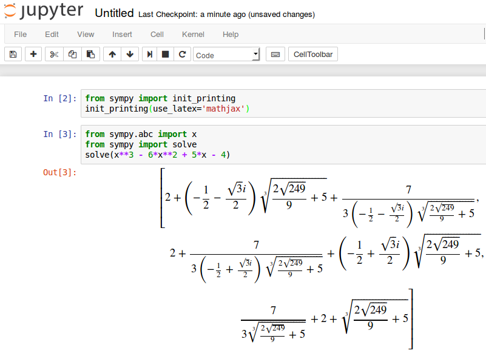
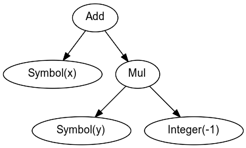

Calcul symbolique
=================

.. contents:: **Contenu**
   :local:

.. code:: pycon

    >>> from __future__ import division, print_function  # Python 3

En Python, la fonction ``sqrt`` retourne un résultat approximé sur les nombres
flottants:

.. code:: pycon

    >>> from math import sqrt
    >>> sqrt(3)
    1.73205080757

La racine de 3 ne peut pas être écrite exactement avec un nombre fini de
décimales, car c'est un nombre irrationel. La façon la plus exacte d'exprimer
la racine (positive) du nombre trois est de l'écrire tel quel. En SymPy, la
racine carrée de 3 est exprimée *symboliquement*:

.. code:: pycon

    >>> from sympy import sqrt
    >>> sqrt(3)
    sqrt(3)

Quand c'est possible, SymPy procède à des simplifications:

.. code:: pycon

    >>> sqrt(4)
    2
    >>> sqrt(8)
    2*sqrt(2)

Variable symbolique 
-------------------

La fonction ``Symbol`` de SymPy permet de créer une variable symbolique:

.. code:: pycon

    >>> from sympy import Symbol
    >>> a = Symbol("a")     # le symbole a est stocké dans la variable a
    >>> a
    a

Cette variable peut être additionnée, soustraite, multipliée et divisée:

.. code:: pycon

    >>> a + a + a + a * a + 1/a - a
    a**2 + 2*a + 1/a

Pour plus de commodité, on peut importer les variables les plus souvent
utilisées du sous-module ``abc``:

.. code:: pycon

    >>> from sympy.abc import a, epsilon
    >>> a + a * a + epsilon
    a**2 + a + epsilon

Définir les variables symboliques x_1, x_2, ..., x_n
----------------------------------------------------

En SymPy, on peut créer plusieurs variables `x_i` indicées pour `i=a,...,b-1` à
l'aide de la fonction ``symbols("xa:b")`` où ``a`` et ``b`` sont remplacés par
des nombres entiers:

.. code:: pycon

    >>> from sympy import symbols
    >>> x4,x5,x6,x7,x8 = symbols("x4:9")
    >>> x4 + x5 + x6 + x7 + x8
    x4 + x5 + x6 + x7 + x8

Affichage automatique des résultats en LaTeX 
--------------------------------------------

Pour que les résultats soient affichés en LaTeX automatiquement, il suffit
d'utiliser la commande suivante une seule fois pour le fichier:

.. code:: pycon

    >>> from sympy import init_printing
    >>> init_printing(use_latex='mathjax')

Dans le notebook Jupyter, cette commande utilise la librairie MathJax.

Dans ces notes, on utilisera l'option ``init_printing(use_latex='mathjax',
use_unicode=False)`` lorsque cela aide la lecture des formules.
Pour un exemple de la section précédente, on obtient:

.. code:: pycon

    >>> from sympy.abc import a, epsilon
    >>> a + a * a + epsilon
     2
    a  + a + ε

Expressions symboliques
-----------------------

On peut faire des calculs impliquant plus d'une variable:

.. code:: pycon

    >>> from sympy.abc import a,b
    >>> (a + b)**2
    (a + b)**2

ou impliquant les fonctions de SymPy:

.. code:: pycon

    >>> from sympy import sin,cos
    >>> sin(a)**2 + cos(a)**2 + b
    b + sin(a)**2 + cos(a)**2

Les expressions symboliques peuvent combiner des rationels, des fonctions et
des constantes de toutes sortes:

.. code:: pycon

    >>> from sympy import Rational,pi,exp,I
    >>> from sympy.abc import x,y
    >>> Rational(3,2)*pi + exp(I*x) / (x**2 + y)
    3*pi/2 + exp(I*x)/(x**2 + y)

Représentation interne
----------------------

Pour voir comment une expression symbolique est représentée dans la machine, on
peut utiliser la fonction ``srepr``:

.. code:: pycon

    >>> from sympy import srepr
    >>> expr = x - y
    >>> srepr(x - y)
    "Add(Symbol('x'), Mul(Integer(-1), Symbol('y')))"

L'expression symbolique est représentée par un arbre d'opérations.

Pour information, l'image a été créée avec Graphviz avec le resultat de la
fonction ``dotprint``:

.. code:: pycon

    >>> from sympy.printing.dot import dotprint
    >>> s = dotprint(expr)

Substitutions
-------------

Pour substituer certaines variables dans une ``expression``, on utilise la
méthode ``subs`` qui s'écrit **après** l'expressions sous la forme
``expressions.subs(<INPUT>)``. Par exemple:

.. code:: pycon

    >>> from sympy.abc import a,b,c
    >>> expression = a + 2*b + 3*c
    >>> expression.subs(a,9)
    2*b + 3*c + 9

Pour faire plus d'une substitutions, on peut les indiquer dans un dictionaire
(``{}``) comme ci-bas:

.. code:: pycon

    >>> expression.subs({a:9, b:4})
    3*c + 17
    >>> expression.subs({a:9, b:4, c:100})
    317

On peut aussi substituer une variable symbolique par une expression
symbolique:

.. code:: pycon

    >>> from sympy import log
    >>> from sympy.abc import x,y,z
    >>> expression.subs({a:x**2, b:log(y), c:z})
    x**2 + 3*z + 2*log(y)

Constantes symboliques
----------------------

Contrairement au module ``math`` de Python où le nombre pi est représenté par
une approximation décimale, dans SymPy, le nombre pi est représenté
symboliquement. C'est une **constante symbolique**:

.. code:: pycon

    >>> from sympy import pi
    >>> pi
    pi

Cela permet de faire des calculs exacts. Par exemple, le sinus d'un angle de
:

.. code:: pycon

    >>> from sympy import sin, pi
    >>> sin(pi/3)
      ___
    \/ 3
    -----
      2

La fonction inverse du sinus aussi appelée arc sinus et représentée par la
fonction ``asin`` dans SymPy peut retourner des expressions symboliques
impliquant des constantes symboliques telles que le nombre `\pi`:

.. code:: pycon

    >>> from sympy import asin, Rational
    >>> asin(1)
    pi
    --
    2
    >>> asin(Rational(1,2))
    pi
    --
    6

SymPy sait que les fonctions sinus et arc sinus sont inverses une de l'autre:

.. code:: pycon

    >>> from sympy.abc import x
    >>> sin(asin(x))
    x

**ATTENTION**

La fonction ``sin`` du module ``math`` de Python ne peut pas être appelée sur
des expressions symboliques, car elle assume que l'argument est un nombre réel
(type float):

.. code:: pycon

    >>> from sympy.abc import 
    >>> from math import sin
    >>> sin(x)
    Traceback (most recent call last):
    ...
    TypeError: can't convert expression to float

Simplifier une expression
-------------------------

Les expressions ne sont pas toujours simplifiées:

.. code:: pycon

    >>> from sympy import sin,cos
    >>> from sympy.abc import a
    >>> r = sin(a)**2 + cos(a)**2
    >>> r
    sin(a)**2 + cos(a)**2

Pour simplifier une expression, on utilise la commande
``simplify``:

.. code:: pycon

    >>> from sympy import simplify
    >>> simplify(r)
    1

Voici un autre exemple:

.. code:: pycon

    >>> simplify((x**3 + x**2 - x - 1)/(x**2 + 2*x + 1))
    x - 1

La fonction ``simplify`` performe une série de simplifications dans un ordre
bien choisi. Les simplifications spécifiques incluent ``besselsimp``,
``combsimp``, ``exptrigsimp``, ``hypersimp``, ``nsimplify``, ``powsimp``,
``radsimp``, ``ratsimp``, ``ratsimpmodprime``, ``signsimp``, ``simplify``,
``simplify_logic``, ``trigsimp`` et d'autres encore.  Il suffit de consulter le
code ``simplify??`` pour voir ce qui se passe et dans quel ordre. 

Lorsque l'on sait exactement ce qu'on veut faire sur l'expression symbolique
(factoriser, mettre sur un dominateur commun, etc.), on peut utiliser
directement la bonne fonction. Cela peut retourner un résultat plus rapidement.
Les plus importantes fonctions de modification d'expressions symboliques sont
décrites dans les sections qui suivent. On trouvera plus d'informations sur les
façons de simplifier une expression dans le tutoriel de SymPy:
http://docs.sympy.org/latest/tutorial/simplification.html

Développer une expression
-------------------------

Pour développer une expression, on utilise la fonction ``expand``:

.. code:: pycon

    >>> from sympy import expand
    >>> from sympy.abc import a,b
    >>> (a + b)**2
    (a + b)**2
    >>> expand((a + b)**2)
    a**2 + 2*a*b + b**2

Cela peut mener à des simplifications:

.. code:: pycon

    >>> (a + b)**2 - (a - b)**2
    -(a - b)**2 + (a + b)**2
    >>> expand(_)
    4*a*b

**Note**: En IPython et Jupyter, la barre de soulignement (``_``) est une
variable qui contient le dernier résultat calculé.  Aussi, la double barre de
soulignement (``__``) est une variable qui contient l'avant-dernier résultat
calculé.  Finalement, la triple barre de soulignement (``___``) est une
variable qui contient l'avant-avant-dernier résultat calculé.  La quadruple
barre de soulignement ne contient rien.

Annuler les facteurs communs d'une fraction
-------------------------------------------

Pour annuler les facteurs communs dans une fonction rationnelle, on utilise
``cancel``:

.. code:: pycon

    >>> expr = (x**2 + x*y) / x
    >>> expr
    (x**2 + x*y)/x
    >>> from sympy import cancel
    >>> cancel(expr)
    x + y

Factoriser un polynôme
----------------------

La fonction ``factor`` de SymPy permet de factoriser un polynôme en un produit
de facteurs irréductibles sur l'anneau des nombres rationnels:

.. code:: pycon

    >>> from sympy import factor
    >>> factor(x**3 - x**2 + x - 1)
    (x - 1)*(x**2 + 1)

Pour factoriser le polynôme sur les nombres de Gauss (nombres complexes à
parties imaginaire et réelle entières), on ajoute l'option ``gaussian=True``:

.. code:: pycon

    >>> factor(x**3 - x**2 + x - 1, gaussian=True)
    (x - 1)*(x - I)*(x + I)

Pour faire la factorisation sur une extension algébrique des nombres
rationnels, il suffit de spéficifier un ou des nombres algébriques qui
engendrent l'extension:

.. code:: pycon

    >>> factor(x**2 - 5)
    x**2 - 5
    >>> factor(x**2 - 5, extension=sqrt(5))
    (x - sqrt(5))*(x + sqrt(5))

Consulter la documentation ``factor?`` pour obtenir de l'aide sur la
factorisation de polynômes sur d'autres domaines ou sur des extensions de
corps.

Rassembler les termes d'une expression
--------------------------------------

La fonction ``collect`` rassemble les puissances communes d'un terme dans une
expression. Par exemple:

.. code:: pycon

    >>> expr = x*z + x**2 + x + x*y + x**2 * w + 5 - x**3
    >>> expr
    w*x**2 - x**3 + x**2 + x*y + x*z + x + 5

On rassemble les termes selon les puissances de ``x``:

.. code:: pycon

    >>> from sympy import collect
    >>> collect(expr, x)
    -x**3 + x**2*(w + 1) + x*(y + z + 1) + 5

Réduire au même dénominateur
----------------------------

.. Pour cette section, on active l'affichage joli:

.. .. code:: pycon

..  >>> from sympy import init_printing
    >>> init_printing(pretty_print=True, use_unicode=False)

Une somme de fonctions rationnelles reste sous forme de somme:

.. code:: pycon

    >>> from sympy.abc import x,y,z
    >>> 1/(x+1) + 1/y + 1/z
      1     1   1
    ----- + - + -
    x + 1   z   y

Pour la mettre au même dénominateur, on utilise ``ratsimp``:

.. code:: pycon

    >>> from sympy import ratsimp
    >>> ratsimp(1/(x+1) + 1/y + 1/z)
    x*y + x*z + y*z + y + z
    -----------------------
          x*y*z + y*z

Alternativement, on peut aussi utiliser la fonction ``together``. À la
différence de ``ratsimp`` la fonction ``together`` préserve le plus possible
les termes sous la forme initiale:

.. code:: pycon

    >>> from sympy import together
    >>> together(1/(x+1) + 1/y + 1/z)
    y*z + y*(x + 1) + z*(x + 1)
    ---------------------------
            y*z*(x + 1)

Décomposition en fractions partielles
-------------------------------------

Soit un fraction rationnelle:

.. code:: pycon

    >>> expr = (3*x**2  + 52*x - 265) / ((x - 7)*(x - 1)*(x + 34))
    >>> expr
          2
       3*x  + 52*x - 265
    ------------------------
    (x - 7)*(x - 1)*(x + 34)

On peut la décomposer en somme de fractions rationnelles à l'aide de la
fonction ``apart`` de SymPy:

.. code:: pycon

    >>> from sympy import apart
    >>> apart(expr)
      1        1       1
    ------ + ----- + -----
    x + 34   x - 1   x - 7

Rationalisation du dénominateur d'une expression
------------------------------------------------

Pour rationaliser le dénominateur d'un expression, on utilise la fonction
``radsimp`` de SymPy:

.. code:: pycon

    >>> A = 1 / (1+sqrt(5))
    >>> A
        1    
    ---------
          ___
    1 + \/ 5 
    >>> from sympy import radsimp
    >>> radsimp(A)
           ___
    -1 + \/ 5 
    ----------
        4     
