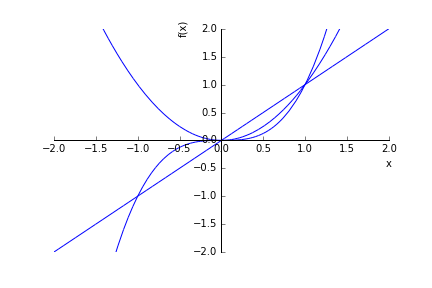
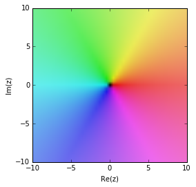

Tracer une fonction
===================

.. contents:: **Contenu**
   :local:

::

    >>> from __future__ import division, print_function   # Python 3
    >>> from sympy import init_printing
    >>> init_printing(use_latex='mathjax',use_unicode=False)  # Affichage des résultats

La librairie Sympy utilise matplotlib__, une autre librairie de Python, pour
faire des dessins. Pour activer l'affichage des graphiques dans Jupyter, on
écrit d'abord ceci dans une cellule::

    >>> %matplotlib inline

__ http://matplotlib.org/ 

Tracer une fonction `\RR\to\RR`
-------------------------------

On importe la fonction ``plot`` qui permet de dessiner des fonctions::

    >>> from sympy import plot  

Un premier exemple. Par défaut, l'intervalle pour les `x` est `[-10,10]`::

    >>> from sympy import sin
    >>> from sympy.abc import x
    >>> plot(sin(x))

Un deuxième exemple sur l'intervalle `[-100, 100]`::

    >>> plot(sin(x)/x, (x,-100,100))

On trace une parabole de couleur rouge dans l'intervale `[-5, 5]` avec un titre::

    >>> plot(x**2+x-6, (x,-5,5), line_color='red', title='Youpi')

Tracer plusieurs fonctions `\RR\to\RR`
--------------------------------------

On trace plusieurs fonctions sur le même intervalle de la façon suivante.  Dans
cet exemple, on a aussi spécifier une limite inférieure et supérieure pour
l'axe des `y`::

    >>> plot(x, x**2, x**3, (x, -2, 2), ylim=(-2,2))

Pour dessiner les trois fonctions avec des couleurs différentes, il faut créer
un dessin à la fois et ensuite les combiner. L'option ``show=False`` permet
d'éviter d'afficher les dessins intermédiaires::

    >>> p1 = plot(x,    (x, -1, 1), show=False, line_color='b')
    >>> p2 = plot(x**2, (x, -1, 1), show=False, line_color='r')
    >>> p3 = plot(x**3, (x, -1, 1), show=False, line_color='g')

On ajoute à ``p1`` les graphes ``p2`` et ``p3``::

    >>> p1.extend(p2)
    >>> p1.extend(p3)

Maintenant ``p1`` contient les trois graphes::

    >>> print(p1)
    Plot object containing:
    [0]: cartesian line: x for x over (-1.0, 1.0)
    [1]: cartesian line: x**2 for x over (-1.0, 1.0)
    [2]: cartesian line: x**3 for x over (-1.0, 1.0)

On affiche le graphe des trois fonctions::

    >>> p1.show()

Tracer une fonction `\RR^2\to\RR`
---------------------------------

On importe la fonction ``plot3d`` du sous-module ``sympy.plotting``::

    >>> from sympy.plotting import plot3d

Un premier exemple::

    >>> from sympy.abc import x,y
    >>> plot3d(x**2+y**2)

Un deuxième exemple::

    >>> plot3d(sin(x*10)*cos(y*4), (x, -1, 1), (y, -1, 1))

On trouvera d'autres exemples en consultant la documentation de ``plot?`` et
``plot3d?`` ou dans la section Plotting du tutoriel de Sympy:
http://docs.sympy.org/latest/modules/plotting.html

Dessiner une fonction `\RR\to\RR^2`
-----------------------------------

Dans cette section et les suivantes, on aura utilisera les fonctions et
variables symboliques suivantes::

    >>> from sympy import sin, cos
    >>> from sympy.abc import u, v

La fonction ``plot_parametric`` permet de tracer des fonctions paramétrés
`\RR\to\RR^2`. Par exemple, on trace la `courbe de Lissajous`__ lorsque
`a=3` et `b=2`::

    >>> from sympy.plotting import plot_parametric
    >>> plot_parametric(cos(3*u), sin(2*u), (u, -5, 5))

__ https://en.wikipedia.org/wiki/Lissajous_curve

Dessiner une fonction `\RR\to\RR^3`
-----------------------------------

La fonction ``plot3d_parametric_line`` permet de tracer des courbes dans
l'espace 3d. Par exemple, on trace une hélice::

    >>> from sympy.plotting import plot3d_parametric_line
    >>> plot3d_parametric_line(cos(u), sin(u), u, (u, -15, 15))

Dessiner une fonction `\RR^2\to\RR^3`
-------------------------------------

La fonction ``plot3d_parametric_surface`` permet de tracer des surfaces
dans `\RR^3`. Par exemple, on trace un tore::

    >>> from sympy.plotting import plot3d_parametric_surface
    >>> X = cos(u)*(5+2*cos(v))
    >>> Y = sin(u)*(5+2*cos(v))
    >>> Z = 2*sin(v)
    >>> plot3d_parametric_surface(X, Y, Z, (u, -.5, 4), (v, -5, 5))

Dessiner les solutions d'une équation implicite
-----------------------------------------------

::

    >>> from sympy import plot_implicit, Eq
    >>> from sympy.abc import x, y

La fonction ``plot_implicit`` permet de tracer les solutions d'une équation
implicite::

    >>> eq = Eq(x**2+y**2+x*y-2*x, 5)
    >>> eq
    x**2 + x*y - 2*x + y**2 == 5
    >>> plot_implicit(eq)

On peut modifier les étendues des variables ``x`` et ``y`` de la façon suivante
(le dessin n'est pas affiché dans ces notes)::

    >>> plot_implicit(eq, (x,-2,5), (y,-5,3))

Tracer une région de `\RR^2`
----------------------------

La fonction ``plot_implicit`` peut aussi servir à dessiner une région de points
qui satisfont une inégalité::

    >>> plot_implicit(y > 2*x+1)

Pour tracer la région définie par plusieurs inégalités, on utilise la fonction
``And`` de sympy::

    >>> from sympy import And
    >>> plot_implicit(And(y>2*x+1, y<5*x, x+y<5))

Dessiner une fonction complexe avec mpmath
------------------------------------------

mpmath__ est une librairie Python pour faire des calculs en précision
arbitraire sur les nombres flottants. Elle permet aussi de faire des `dessins
de fonctions complexes`__.

__ http://mpmath.org/
__ http://mpmath.googlecode.com/svn/gallery/gallery.html

La façon d'importer la librairie mpmath n'est pas exactement la même selon
qu'on utilise une installation normale de SymPy ou qu'on utilise SageMath::

    >>> from sympy import mpmath    # Sympy (installation normale)
    >>> import mpmath               # SageMath

Rappelons que sans la ligne suivante, les dessins ne s'afficheront pas::

    >>> %matplotlib inline

La syntaxe des arguments n'est pas exactement la même que pour la fonction
``plot`` de SymPy. Il faut définir une fonction Python avec la commande ``def``
ou encore sur une ligne avec ``lambda``. Par exemple, la fonction identité peut
s'écrire ``lambda z:z`` en Python.

On trace la fonction identité pour comprendre la signification de l'image
obtenue::

    >>> mpmath.cplot(lambda z: z, [-10, 10], [-10, 10])

Les couleurs de l'arc en ciel doivent être interprétés comme l'argument d'un
nombre complexe (rouge pour un nombre réel positif). Le module du nombre
complexe est représenté par la transparence (0=noir opaque, `\infty` = ``oo`` =
blanc transparent).

De la même façon, on ne peut pas utiliser le ``I`` de sympy avec mpmath, il
faut utiliser les nombres complexes de Python. Le dessin suivant illustre la
multiplication par le nombre complexe `i`, c'est-à-dire une rotation de 90
degrés::

    >>> I = complex(0,1)         # le nombre complexe I de Python
    >>> mpmath.cplot(lambda z: I*z, [-10, 10], [-10, 10])

Les pixels en rouges sont envoyés sur la droite réelle positive par la fonction
``lambda z: I*z``.

Le dessin suivant permet de voir les cinq racines cinquième de l'unité::

    >>> mpmath.cplot(lambda z: z**5-1, [-2, 2], [-2, 2])

Cela permet aussi d'étudier les zéros de la fonction zeta de Riemann::

    >>> from mpmath import zeta
    >>> mpmath.cplot(zeta, [-10, 10], [-50, 50])

mpmath offre aussi sa propre fonction de dessin ``mpmath.plot`` ainsi qu'une
fonction pour dessiner des surfaces en 3d ``mpmath.splot``. On trouvera
d'autres exemples dans la page suivante de la documentation de Sympy:
http://docs.sympy.org/latest/modules/mpmath/plotting.html

.. Histogrammes
   ------------
   Histogramme::
    >>> import numpy.random
    >>> hist(np.random.randn(10000), 100)

