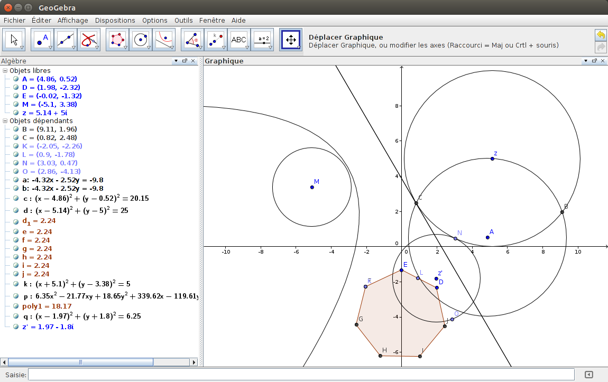
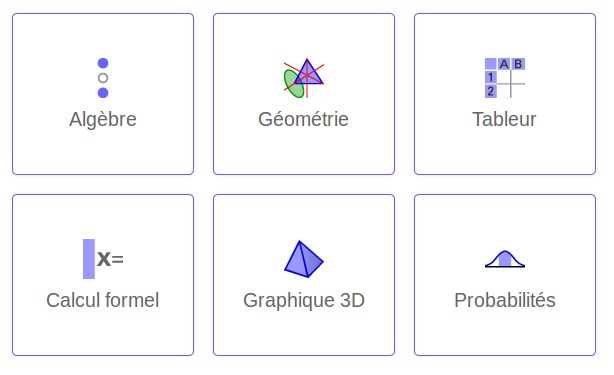
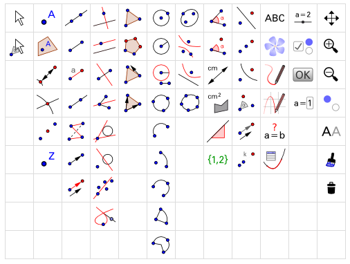

GeoGebra
========

.. contents:: **Contenu**
   :local:

GeoGebra__ est un environnement mathématique dynamique qui allie géométrie,
algèbre et calculs. Il a été développé pour apprendre et enseigner les
mathématiques par Markus Hohenwarter et une équipe internationale de
programmeurs. GeoGebra `peut être installé`__ sur tous les types d'ordinateurs,
mais il y a aussi une version pour les tablettes et téléphones. Finalement, il
est possible d'utiliser GeoGebra directement sur internet à l'adresse
app.geogebra.org__ et de profiter de plus de 300 000 ressources d'enseignement
et d'apprentissage interactif sur tube.geogebra.org__.

__ http://www.geogebra.org/
__ http://www.geogebra.org/download
__ http://app.geogebra.org/
__ http://tube.geogebra.org/

Crédits: certains passages de ce chapitre proviennent de la page de `wikipédia
sur GeoGebra`__ et du `wiki de GeoGebra`__ où on trouvera de plus amples
informations.

__ https://en.wikipedia.org/wiki/GeoGebra
__ https://www.geogebra.org/wiki/fr/AccueilManuel

L'interface principale est divisée en fenêtres. Par défaut, la fenêtre
*Algèbre* est affichée sur le côté gauche, la fenêtre *Graphique* sur le côté
droit. Au dessus d'elles, il y a la Barre de menus et la Barre d'outils.
Beaucoup de fonctionnalités de GeoGebra peuvent être appelées par des
raccourcis clavier. GeoGebra contient aussi des fonctions d'accessibilité telle
qu'un clavier virtuel.

Tout objet créé dans la fenêtre *Graphique* a aussi une représentation
algébrique dans la fenêtre *Algèbre* et peut être modifié à partir de la
fenêtre *Algèbre* ou de la fenêtre *Graphique*.

GeoGebra peut être utilisé pour faire du calcul symbolique (la fenêtre *Calcul
formel*) comme SymPy et Mathematica ou pour manipuler des données (la fenêtre
*Tableur*) comme Excel. Dans ce cours, nous nous concentrerons plutôt sur les
fonctionnalités de géométrie et d'algèbre offertes par GeoGebra.

Les icônes de la barre d'outils permettent de faire un ensemble de
constructions géométriques dans la fenêtre *Graphique*. Colonne par colonne et
de gauche à droite dans l'image ci-haut, on retrouve différents outils pour:

 - déplacer des points
 - créer des points
 - créer des droites, segments et vecteurs
 - créer des droites perpendiculaires, parallèles, bissectrices, médiatrices, tangentes
 - créer des polygones
 - créer des cercles, arcs de cercle, de secteurs
 - créer des ellipses, d'hyperboles, de paraboles et autres coniques
 - calculer des angles, distances, aires, pentes
 - calculer symmétries, d'inversions, de rotations, d'homothéties, de translations
 - insérer du texte et des images
 - créer des curseurs et des boutons
 - déplacer, zoomer et afficher ou cacher des objets

La plupart du temps, les quelques mots d'aide indiqués dans la Barre d'outils
(cette option doit être activée dans les préférences) sont suffisants pour
comprendre comment utiliser l'outil sélectionné. Sinon, on se référera à la
`page wiki`__ qui décrit comment utiliser chacun des icônes ci-haut ou sinon
aux chapitres 1 et 2 (pages 1 à 30) du Manuel d'introduction à GeoGebra [GeoGebra]_.

.. [GeoGebra] Introduction à GeoGebra, Version 4.4,
   traduction en français par Noël Lambert, novembre 2013,
   http://static.geogebra.org/book/intro-fr.pdf

__ https://www.geogebra.org/wiki/fr/Graphique

.. Table des matières

.. - Introduction & Installation. Dessins ou Constructions Géométriques

..  1. Introduction et Installation de GeoGebra.
  2. Manipulations de base de GeoGebra
  3. Créer des illustrations dans GeoGebra.
  4. Dessins, Constructions, et Test de Déplacement.
  5. Construction de rectangle.
  6. Barre de navigation et Protocole de construction.
  7. Construction de triangle équilatéral.
  8. Propriétés des objets GeoGebra.
  9. Challenge du jour : Construction de triangle isocèle.

.. - Constructions géométriques & Utilisation des commandes

..  1. Construction de carré. 
  2. Construction d’hexagone régulier 
  3. Construction du cercle circonscrit à un triangle 
  4. Théorème du triangle inscrit dans un demi-cercle.
  5. Construction des tangentes à un cercle.
  6. Exploration des coefficients d’un trinôme du 2d degré.
  7. Utilisation de curseurs pour modifier les coefficients.
  8. Challenge du jour : Coefficients du trinôme.

**Apprendre à utiliser GeoGebra sur Youtube**

Comme GeoGebra est un outil très dynamique et interactif, il est parfois plus
facile d'apprendre à l'utiliser en regardant comment les autres font. La
`chaîne Youtube de GeoGebra`__ contient une multitude de vidéos qui permettent
d'en apprendre sur toutes les fonctionalités de GeoGebra, sans compter les
vidéos créés par les utilisateurs.

__ http://www.youtube.com/user/GeoGebraChannel

Ci-bas, on retrouve les vidéos qui couvrent les chapitres 1 et 2 du manuel
d'introduction à Géogebra mentionné plus haut:

 - `Construction d'un rectangle <http://youtu.be/t3-QM2daH0o>`_, 58 s.
 - `Construction d'un triangle équilatéral <http://youtu.be/LCQPeMsC5_Y>`_, 1min.
 - `Construction d'un carré <http://youtu.be/qifsRZmNK4I>`_, 1min 21s.
 - `Construction d'un hexagone régulier <http://youtu.be/yLCead7g3Do>`_, 1min 51s.
 - `Construction d'un cercle circonscrit à un triangle <http://youtu.be/SNV5ae_jxoA>`_, 58s.
 - `Théorème du triangle inscrit dans un demi-cercle <http://youtu.be/0gRPyOuS3Yg>`_, 57s.
 - `Construction des tangentes à un cercle <http://youtu.be/eJMApJR9qeY>`_, 3min 11s.
 - `Explorer les paramètres d'un polynôme quadratique <http://youtu.be/T_S_JhvvMCk>`_, 1min 18s.
 - `Utilisation des curseurs pour modifier des coefficients <http://youtu.be/DuRaA3Kf6NU>`_, 1min 15s.
 - `Visualiser la multiplication des nombres entiers <http://youtu.be/X8-DymOP2pM>`_, 5min 31s.
 - `Geogebra fun trick <http://youtu.be/jtlCE5uTEDM>`_, 2min 40s.

.. André Boileau, chapitre 6 sur Geogebra, la géométrie dynamique avec Geogebra, 35 p.
.. http://www.math.uqam.ca/~expresso/LivreLogicielsOutils/Chapitre6GeoGebra.pdf

.. Comparaison entre Cabri et GeoGebra. Score 30 à 9 pour GeoGebra.
.. http://www.math.uqam.ca/~boileau/Explorations2008/Comparaison.pdf

