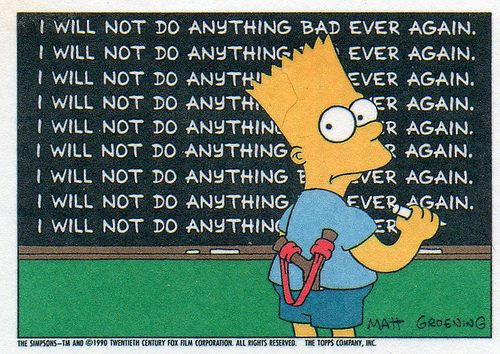

Boucles ``for`` et ``while``
============================

Dans ce chapitre et les suivants, nous traitons de la programmation en Python.
Les notes ici présentent les grandes lignes et les éléments principaux de ce
sujet. Le lecteur désirant en savoir plus sera invité à consulter les chapitres
1 à 7 du livre en français de G. Swinnen [Apprendre]_ ou encore les chapitre 1
à 11 du livre en anglais de Wentworth et al. [Think]_ Scientist - Learning with
Python.

.. [Apprendre] Gérard Swinnen, Apprendre à programmer avec Python 3, 2012.
   http://inforef.be/swi/download/apprendre_python3_5.pdf

.. [Think] Peter Wentworth, Jeffrey Elkner, Allen B. Downey, and Chris Meyers,
   How to Think Like a Computer Scientist - Learning with Python, 3nd
   Edition, 2012.
   http://openbookproject.net/thinkcs/python/english3e/

Une boucle permet de faire des tâches répétitives sur un ordinateur avec un
moindre effort.

::

    >>> for a in range(9):
    ...     print("I will not do anything bad ever again.")
    I will not do anything bad ever again.
    I will not do anything bad ever again.
    I will not do anything bad ever again.
    I will not do anything bad ever again.
    I will not do anything bad ever again.
    I will not do anything bad ever again.
    I will not do anything bad ever again.
    I will not do anything bad ever again.
    I will not do anything bad ever again.

La boucle ``for``
-----------------

La boucle for permet aussi de parcourir les éléments d'une liste, une chaîne
de caractères ou en général de tout objet itérable::

    >>> for a in [1,2,3,4]:
    ...     print(a + 100)
    101
    102
    103
    104
    >>> for a in 'bonjour':
    ...     print('A ' + a + ' Z')
    A b Z
    A o Z
    A n Z
    A j Z
    A o Z
    A u Z
    A r Z

En Python, une boucle ``for`` est identifiée par une ligne d'en-tête commançant
par ``for`` se terminant par un deux-points ``:`` et avec la syntaxe ``for TRUC
in MACHIN:``. La convention est de toujours utiliser 4 espaces pour indenter 
les lignes du bloc d'instructions qui appartient à la boucle::

    for i in liste:                       # ligne d'en-tête
        <ligne 1 du bloc d'instruction>
        <ligne 2 du bloc d'instruction>
        ...
        <ligne n du bloc d'instruction>
    <ligne exécutée après la boucle>

Le bloc d'instructions est exécuté autant de fois qu'il y a d'éléments dans la
liste. Le bloc d'instruction est exécuté une fois pour chaque valeur de la
variable ``i`` dans la liste.

Un exemple de boucle ``for`` avec Sympy
---------------------------------------

Supposons que l'on désire factoriser le polynôme ``x**k-1`` pour toutes les
valeurs de ``k=1..9``. En SymPy, il est possible d'écrire onze fois le même
calcul où on change la valeur de l'exposant ``k`` à chaque fois::

    >>> from sympy import factor
    >>> from sympy.abc import x
    >>> factor(x**1-1)
    x - 1
    >>> factor(x**2-1)
    (x - 1)*(x + 1)
    >>> factor(x**3-1)
    (x - 1)*(x**2 + x + 1)
    >>> factor(x**4-1)
    (x - 1)*(x + 1)*(x**2 + 1)
    >>> factor(x**5-1)
    (x - 1)*(x**4 + x**3 + x**2 + x + 1)
    >>> factor(x**6-1)
    (x - 1)*(x + 1)*(x**2 - x + 1)*(x**2 + x + 1)
    >>> factor(x**7-1)
    (x - 1)*(x**6 + x**5 + x**4 + x**3 + x**2 + x + 1)
    >>> factor(x**8-1)
    (x - 1)*(x + 1)*(x**2 + 1)*(x**4 + 1)
    >>> factor(x**9-1)
    (x - 1)*(x**2 + x + 1)*(x**6 + x**3 + 1)

La boucle ``for`` permet répéter une action pour toutes les valeurs d'une
liste. En utilisant une boucle ``for``, l'exemple ci-haut peut se réécrire plus
facilement::

    >>> for k in range(1,12):
    ...     print(factor(x**k-1))
    x - 1
    (x - 1)*(x + 1)
    (x - 1)*(x**2 + x + 1)
    (x - 1)*(x + 1)*(x**2 + 1)
    (x - 1)*(x**4 + x**3 + x**2 + x + 1)
    (x - 1)*(x + 1)*(x**2 - x + 1)*(x**2 + x + 1)
    (x - 1)*(x**6 + x**5 + x**4 + x**3 + x**2 + x + 1)
    (x - 1)*(x + 1)*(x**2 + 1)*(x**4 + 1)
    (x - 1)*(x**2 + x + 1)*(x**6 + x**3 + 1)

Pour différencier les lignes, il est possible d'afficher plus d'informations::

    >>> from sympy import Eq
    >>> for k in range(2, 10):
    ...     expr = x**k-1
    ...     eq = Eq(expr, factor(expr))
    ...     print(eq)
    x**2 - 1 == (x - 1)*(x + 1)
    x**3 - 1 == (x - 1)*(x**2 + x + 1)
    x**4 - 1 == (x - 1)*(x + 1)*(x**2 + 1)
    x**5 - 1 == (x - 1)*(x**4 + x**3 + x**2 + x + 1)
    x**6 - 1 == (x - 1)*(x + 1)*(x**2 - x + 1)*(x**2 + x + 1)
    x**7 - 1 == (x - 1)*(x**6 + x**5 + x**4 + x**3 + x**2 + x + 1)
    x**8 - 1 == (x - 1)*(x + 1)*(x**2 + 1)*(x**4 + 1)
    x**9 - 1 == (x - 1)*(x**2 + x + 1)*(x**6 + x**3 + 1)

Affectation d'une variable
--------------------------

Pour affecter une valeur dans une variable, on se rappelle que cela se fait
en Python comme en C ou C++ ou Java avec la syntaxe::

    >>> a = 5

La syntaxe ``a == 5`` est réservée pour le test d'égalité.

Mise à jour d'une variable
--------------------------

Quand une instruction d'affectation est exécutée, l'expression de droite (à
savoir l'expression qui vient après le signe ``=`` d'affectation) est évaluée en
premier. Cela produit une valeur. Ensuite, l'assignation est faite, de sorte
que la variable sur le côté gauche se réfère maintenant à la nouvelle valeur.

L'une des formes les plus courantes de l'affectation est une mise à jour,
lorsque la nouvelle valeur de la variable dépend de son ancienne valeur::

    >>> n = 5
    >>> n = 3 * n + 1

Ligne 2 signifie obtenir la valeur courante de ``n``, la multiplier par trois et
ajouter un, et affecter la réponse à ``n``. Donc, après avoir exécuté les deux
lignes ci-dessus, ``n`` va pointer / se référer à l'entier ``16``.

Si vous essayez d'obtenir la valeur d'une variable qui n'a jamais été
attribuée, vous obtenez une erreur::

    >>> W = x + 1
    Traceback (most recent call last):
    ...
    NameError: name 'x' is not defined

Avant de pouvoir mettre à jour une variable, vous devez l'initialiser à une
valeur de départ, habituellement avec une valeur simple::

    sous_total = 0
    ...
    sous_total = sous_total + 1

La mise à jour d'une variable en lui ajoutant 1 à celle-ci est très commune.
On appelle cela un **incrément** de la variable; soustraire 1 est appelé un
**décrément**.

Quelques exemples
-----------------

L'exemple suivant illustre comment calculer la somme des éléments d'une liste
en utilisant une variable ``s`` initialisée à zéro avant la boucle::

    >>> L = [134, 13614, 73467, 1451, 134, 88]
    >>> s = 0
    >>> for a in L:
    ...     s = s + a
    >>> s
    88888
    >>> sum(L)
    88888

La boucle ``while``
-------------------

Parfois, on ne sait pas à l'avance combien de fois on voudra exécuter un bloc
d'instructions. Dans ce cas, il vaut mieux utiliser une boucle ``while`` dont
la syntaxe est::

    while CONDITION:
        INSTRUCTION 1
        INSTRUCTION 2
        ...
        INSTRUCTION n

Le bloc d'instruction est exécuté tant que la condition est satisfaite. Par
exemple, on peut afficher les puissances de 5 inférieures à un million avec une
boucle ``while``::

    >>> a = 1
    >>> while a < 1000000:
    ...     print a
    ...     a = a * 5
    ... 
    1
    5
    25
    125
    625
    3125
    15625
    78125
    390625

Interrompre une boucle avec ``break``
-------------------------------------

La commande ``break`` permet d'interrompre une boucle ``for`` ou ``while`` en
cours::

    >>> for i in range(10):
    ...     if i == 5:
    ...         break
    ...     print(i)
    ...
    0
    1
    2
    3
    4

On remarque que les valeurs plus grandes que 4 n'ont pas été imprimées par la
fonction ``print``.

Continuer une boucle à l'itération suivante avec ``continue``
-------------------------------------------------------------

La commande ``continue`` permet de continuer le parcours d'une boucle à la
valeur suivante::

    >>> for i in range(10):
    ...     if i == 5:
    ...         continue
    ...     print(i)
    ...
    0
    1
    2
    3
    4
    6
    7
    8
    9

On remarque que la valeur 5 n'a pas été imprimée par la fonction ``print``.

