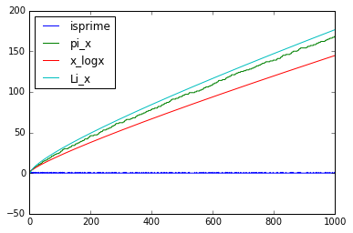
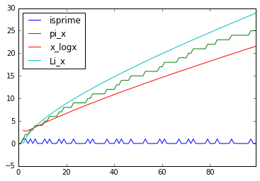
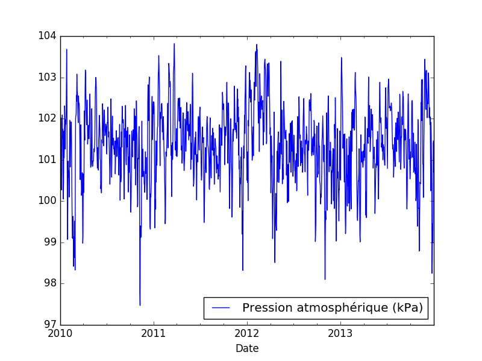
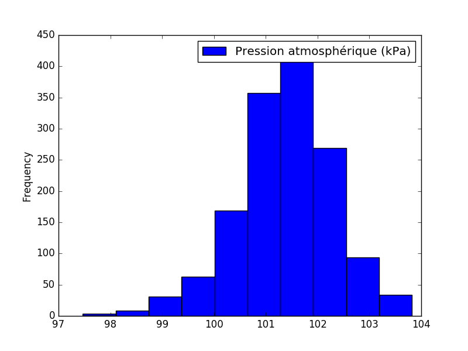

Tableaux et analyse de données avec Pandas
==========================================

Les données massives jouent et continueront de jouer un rôle important dans la
société du 21e siècle. Dans ce chapitre, nous ferons une introduction à une
librairie de l'environnement Python qui permet de représenter et analyser des
données. Cette librairie s'appelle pandas__, contraction des termes anglais
"panel" et "data". Dans pandas, un tableau 3-dimensionnel de données est appelé
un "panel". La librairie pandas joue le même rôle qu'un tableur comme Microsoft
Excel, LibreOffice calc ou celui qu'on retrouve dans GeoGebra.

.. image:: images/pandas_logo.png
   :target: http://pandas.pydata.org/
   :width: 12cm

__ http://pandas.pydata.org/

Les principales structures de données de pandas sont les ``Series`` (pour
stocker des données selon une dimension) et les ``DataFrame`` (pour stocker des
données selon 2 dimensions - lignes et colonnes). On peut aussi représenter des
données selon trois dimensions ou plus avec ``Panel`` et ``Panel4D``.

Dans ce chapitre nous décrivons les tableaux de données à une et deux
dimensions. Nous verrons comment faire des calculs statistiques et créer des
graphiques à partir de celles-ci. Nous verrons comment importer et exporter des
données. Finalement, nous ferons un exemple basé sur le site de données de la
Belgique: http://data.gov.be/. On trouvera plus d'informations dans la
`documentation en ligne`__ de pandas incluant une `introduction en 10
minutes`__, les `notions de base`__ et quelques `tutoriels`__.

__ http://pandas.pydata.org/pandas-docs/stable/
__ http://pandas.pydata.org/pandas-docs/stable/10min.html
__ http://pandas.pydata.org/pandas-docs/stable/basics.html#basics
__ http://pandas.pydata.org/pandas-docs/stable/tutorials.html

Tableau unidimensionnel de données
----------------------------------

En utilisant sympy, construisons une liste de 0 et de 1 telle qu'un 1 est à la
position ``i`` si et seulement si ``i`` est un nombre premier::

    >>> from sympy import isprime
    >>> L = [isprime(i) for i in range(15)]
    >>> L
    [False, False, True, True, False, True, False, True, False, False, False, 
     True, False, True, False]

La librairie pandas permet de représenter les tableaux unidimensionnels de
données appelés *séries*. Faisons un premier exemple. La liste Python ci-haut
peut être transformée en une série de pandas en faisant comme suit::

    >>> from pandas import Series
    >>> s = Series(L)
    >>> s
    0     False
    1     False
    2      True
    3      True
    4     False
    5      True
    6     False
    7      True
    8     False
    9     False
    10    False
    11     True
    12    False
    13     True
    14    False
    dtype: bool

Par défaut, les indices sont les nombres de ``0`` à ``n-1`` où ``n`` est la
taille de la liste. On peut accéder aux éléments de la série de la même façon
qu'on le fait pour les éléments d'une liste::

    >>> s[0]
    False
    >>> s[7]
    True

Afficher quelques statistiques
------------------------------

L'intérêt des séries de pandas par rapport aux listes Python de base est qu'un
grand nombres de fonctions utiles sont disponibles sur les séries de pandas et
qui retournent souvent d'autres séries. Par exemple, on peut obtenir une
brève description statistique des éléments d'une série avec la méthode
``describe()``::

    >>> s.describe()
    count        15
    unique        2
    top       False
    freq          9
    dtype: object

Ci-haut, cela nous indique qu'il y a deux valeurs distinctes dans la série et
que ``False`` est la plus fréquence avec 9 apparitions sur 15. En effet, il y 6
nombres premiers inférieurs à 15.

On peut obtenir la séries des sommes cumulées d'une série avec la méthode
``cumsum()``. Ici ``False`` vaut zéro et ``True`` vaut ``1``::

    >>> s.cumsum()
    0     0
    1     0
    2     1
    3     2
    4     2
    5     3
    6     3
    7     4
    8     4
    9     4
    10    4
    11    5
    12    5
    13    6
    14    6
    dtype: int64

Il suffit de faire ``s.TOUCHE_TABULATION`` pour voir les nombreuses
possibilités offertes par pandas. On y reviendra.

Opérations sur une série
------------------------

Les opérations arithmétiques sont définies sur les séries. Elle sont appliquées
sur chaque terme::

    >>> t = s.cumsum()
    >>> t * 1000 + 43
    0       43
    1       43
    2     1043
    3     2043
    4     2043
    5     3043
    6     3043
    7     4043
    8     4043
    9     4043
    10    4043
    11    5043
    12    5043
    13    6043
    14    6043
    dtype: int64

On peut aussi appliquer une fonction aux éléments d'une série avec la méthode
``apply``::

    >>> def carre_plus_trois(x):
    ...     return x**2 + 3
    >>> t.apply(carre_plus_trois)
    0      3
    1      3
    2      4
    3      7
    4      7
    5     12
    6     12
    7     19
    8     19
    9     19
    10    19
    11    28
    12    28
    13    39
    14    39
    dtype: int64

Concaténation de deux séries
----------------------------

Avec pandas, il est possible de construire un tableau comportant plus d'une
colonne. Par exemple, les nombres premiers dans la première colonne et la somme
cumulée dans la deuxième. Une première façon est avec la fonction ``concat``
qui concatène deux séries::

    >>> from pandas import concat
    >>> concat([s, s.cumsum()])
    0     0
    1     0
    2     1
    3     1
    4     0
    5     1
    6     0
    7     1
    8     0
    9     0
    10    0
    11    1
    12    0
    13    1
    14    0
    0     0
    1     0
    2     1
    3     2
    4     2
    5     3
    6     3
    7     4
    8     4
    9     4
    10    4
    11    5
    12    5
    13    6
    14    6
    dtype: int64

La concaténation a été faite une en-dessous de l'autre et cela a aussi eu pour
effet de transformer les valeurs booléennes en nombres entiers, car les données
d'une même colonne doivent avoir le même type. Ce n'est pas exactement ce qu'on
voulait. Pour spécifier que la concaténation doit être faite en colonnes, il
faut spécifier dans quelle direction (axe) ou veut concaténer les données. On
donne alors une valeur ``1`` à l'argument ``axis`` plutôt que ``0`` (la valeur
par défaut) pour obtenir ce que l'on veut::

    >>> concat([s, s.cumsum()], axis=1)
            0  1
    0   False  0
    1   False  0
    2    True  1
    3    True  2
    4   False  2
    5    True  3
    6   False  3
    7    True  4
    8   False  4
    9   False  4
    10  False  4
    11   True  5
    12  False  5
    13   True  6
    14  False  6

Pour donner des titres plus parlant aux colonnes, il s'agit de spécifier une
liste de titres via l'argument ``keys``. Comme le nombre de nombres entiers
inférieur à ``x`` est souvent dénoté ``pi(x)``, on utilise ``'pi_x'`` pour le
nom de la deuxième colonne::

    >>> keys = ['isprime', 'pi_x']
    >>> df = concat([s, s.cumsum()], axis=1, keys=keys)
    >>> df
       isprime  pi_x
    0    False     0
    1    False     0
    2     True     1
    3     True     2
    4    False     2
    5     True     3
    6    False     3
    7     True     4
    8    False     4
    9    False     4
    10   False     4
    11    True     5
    12   False     5
    13    True     6
    14   False     6

Le type du tableau ci-haut est ``DataFrame`` pour tableau de données::

    >>> type(df)
    <class 'pandas.core.frame.DataFrame'>

Tableau 2-dimensionnel de données
---------------------------------

Une autre façon de créer le même tableau est en utilisant la fonction
``DataFrame`` directement::

    >>> from pandas import DataFrame

D'abord, on calcule en Python la liste des sommes cumulées de la liste ``L``::

    >>> L = [isprime(i) for i in range(15)]
    >>> L_cumsum = [sum(L[:i]) for i in range(1,len(L)+1)]
    >>> L_cumsum
    [0, 0, 1, 2, 2, 3, 3, 4, 4, 4, 4, 5, 5, 6, 6]

On crée un dictionnaire qui associe des noms de colonnes à des valeurs::

    >>> d = {'isprime':L, 'pi_x':L_cumsum}
    >>> d
    {'isprime': [False, False, True, True, False, True, False, True, 
                 False, False, False, True, False, True, False],
     'pi_x': [0, 0, 1, 2, 2, 3, 3, 4, 4, 4, 4, 5, 5, 6, 6]}

On crée un objet de type ``DataFrame`` à partir de ce dictionnaire::

    >>> df = DataFrame(d)
    >>> df
       isprime  pi_x
    0    False     0
    1    False     0
    2     True     1
    3     True     2
    4    False     2
    5     True     3
    6    False     3
    7     True     4
    8    False     4
    9    False     4
    10   False     4
    11    True     5
    12   False     5
    13    True     6
    14   False     6

Comme pour les séries, on peut obtenir les statistiques simples pour les
données de chaque colonne d'un tableau de données avec la méthode
``describe()``::

    >>> df.describe()
                pi_x
    count  15.000000
    mean    3.266667
    std     1.944467
    min     0.000000
    25%     2.000000
    50%     4.000000
    75%     4.500000
    max     6.000000

Il est aussi possible de créer des tableaux de données en dimensions
supérieures, mais cela dépasse le cadre de ce cours::

    >>> from pandas import Panel,Panel4D

Accéder à une colonne d'un tableau
----------------------------------

Le nom des colonnes peut être utilisé pour accéder aux colonnes d'un tableau de
la façon suivante sans parenthèse::

    >>> df.pi_x
    0     0
    1     0
    2     1
    3     2
    4     2
    5     3
    6     3
    7     4
    8     4
    9     4
    10    4
    11    5
    12    5
    13    6
    14    6
    Name: pi_x, dtype: int64

Comme pour un dictionnaire, on peut aussi accéder à une colonne avec les
crochets. Il faut alors spécifier le nom de la colonne entre guillemets::

    >>> df['pi_x']
    0     0
    1     0
    2     1
    3     2
    4     2
    5     3
    6     3
    7     4
    8     4
    9     4
    10    4
    11    5
    12    5
    13    6
    14    6
    Name: pi_x, dtype: int64

Cela peut se combiner avec d'autres méthodes comme l'affichage de
statistiques ``df.pi_x.describe()`` ou encore des calculs::

    >>> df.pi_x * 100
    0       0
    1       0
    2     100
    3     200
    4     200
    5     300
    6     300
    7     400
    8     400
    9     400
    10    400
    11    500
    12    500
    13    600
    14    600
    Name: pi_x, dtype: int64

Afficher les premières/dernières lignes
---------------------------------------

Parfois, on travaille avec des tableaux de très grande taille et il n'est pas
pratique d'afficher toutes les données à l'écran. On construit d'abord un
tableau de 1000 lignes avec les mêmes colonnes que le précédent::

    >>> L = [isprime(i) for i in range(1000)]
    >>> s = Series(L)
    >>> d = {'isprime':s, 'pi_x':s.cumsum()}
    >>> df = DataFrame(d)

Pour afficher les cinq premières lignes d'un tableau de données, on utilise la
méthode ``head()``::

    >>> df.head()
      isprime  pi_x
    0   False     0
    1   False     0
    2    True     1
    3    True     2
    4   False     2

Pour afficher les cinq dernières lignes d'un tableau de données, on utilise la
méthode ``tail()``:: 

    >>> df.tail()
        isprime  pi_x
    995   False   167
    996   False   167
    997    True   168
    998   False   168
    999   False   168

Les deux méthodes ``head`` et ``tail`` peuvent prendre un nombre entier en
argument pour indiquer le nombre de lignes à afficher si on veut en voir plus
ou moins::

    >>> df.tail(10)
        isprime  pi_x
    990   False   166
    991    True   167
    992   False   167
    993   False   167
    994   False   167
    995   False   167
    996   False   167
    997    True   168
    998   False   168
    999   False   168

Sous-tableau
------------

Pour accéder à un sous-tableau de lignes consécutives, on utilise les crochets
comme pour les listes Python. Ici, on affiche le sous-tableau des lignes 500 à
519. En fait, cela crée un nouveau tableau de 20 lignes::

    >>> df[500:520]
        isprime  pi_x   x_logx
    500   False    95  80.4556
    501   False    95  80.5906
    502   False    95  80.7256
    503    True    96  80.8605
    504   False    96  80.9954
    505   False    96  81.1303
    506   False    96  81.2651
    507   False    96  81.3999
    508   False    96  81.5346
    509    True    97  81.6694
    510   False    97   81.804
    511   False    97  81.9387
    512   False    97  82.0733
    513   False    97  82.2079
    514   False    97  82.3425
    515   False    97   82.477
    516   False    97  82.6115
    517   False    97  82.7459
    518   False    97  82.8803
    519   False    97  83.0147

Pour accéder à une donnée particulière dans le tableau, on utilise la méthode
``at`` en spécifiant l'indice de la ligne puis le nom de la colonne entre
crochets::

    >>> df.at[510, 'x_logx']
    81.804042504952918
    >>> df.at[510, 'pi_x']
    97

Ajouter une colonne dans un tableau
-----------------------------------

Supposons que l'on veuille ajouter une colonne à un tableau. Cela se fait avec
la méthode ``insert()``.

Johann Carl Friedrich Gauss avait deviné au 19e siècle que ``pi(x)``, le nombre
de nombres premiers inférieurs à ``x``, était approximativement ``x/log(x)``.
Construisons une série qui calcule cette fonction pour les 1000 premiers
nombres entiers::

    >>> from math import log
    >>> def x_sur_log_x(x): 
    ...     if x > 1:
    ...         return x/log(x)
    ...     else:
    ...         return None
    >>> t = Series(range(1000)).apply(x_sur_log_x)

On ajoute la nouvelle colonne avec la méthode ``insert`` en spécifiant la
position où on veut l'insérer, le titre de la colonne et les données::

    >>> df.insert(2, 'x_logx', t)
    >>> df['x_logx'] = t        # equivalent, notation comme les dictionnaires Python

En 1838, Dirichlet a contacté Gauss pour lui dire qu'il avait trouvé une
meilleure approximation de la fontion ``pi(x)`` en utilisant l'intégrale de
l'inverse de la fonction ``log(x)``, c'est-à-dire par la fonction
``Li(x)=integrate(1/log(t), (t,2,x))``.

En utilisant sympy, calculons les 1000 premières valeurs de ``Li(x)`` et
ajoutons cette colonne dans le tableau::

    >>> from sympy import Li                         
    >>> K = [Li(x).n() for x in range(1000)]
    >>> df['Li_x'] = Series(K, dtype='float64')

On peut afficher les premières et dernières lignes du tableau à quatre colonnes::

    >>> df.head()
      isprime  pi_x   x_logx               Li_x
    0   False     0      NaN  -1.04516378011749
    1   False     0      NaN               -inf
    2    True     1  2.88539                  0
    3    True     2  2.73072   1.11842481454970
    4   False     2  2.88539   1.92242131492156
    >>> df.tail()
        isprime  pi_x   x_logx              Li_x
    995   False   167  144.146  175.840407548189
    996   False   167  144.269  175.985266957056
    997    True   168  144.393  176.130105300461
    998   False   168  144.517  176.274922605648
    999   False   168  144.641  176.419718899799

Visualiser les données
----------------------

On active d'abord les dessins de matplotlib dans le notebook Jupyter::

    %matplotlib inline

Pour visualiser les données, il suffit d'utiliser la commande ``plot``::
    
    >>> df.plot()

On voit bien que ``pi(x)``, le nombre de nombres premiers inférieurs à ``x``,
se trouve bien entre les fonctions ``pi(x)`` et ``Li(x)`` sur l'intervalle
``[0,1000]``.

On peut visualiser qu'une partie par exemple l'intervalle ``[0,100]``  en
choisissant d'abord un sous-tableau::

    >>> df[:100].plot()

D'autres types de graphiques peuvent être plus adaptées dans d'autres
situations (histogrammes, tartes, etc.). Voici la liste méthodes disponibles::

    df.plot.area     df.plot.box      df.plot.hist     df.plot.pie
    df.plot.bar      df.plot.density  df.plot.kde      df.plot.scatter
    df.plot.barh     df.plot.hexbin   df.plot.line

On trouvera des exemples d'utilisation de ces méthodes de visualisation de
données dans la documentation de pandas:
    
http://pandas.pydata.org/pandas-docs/stable/visualization.html#visualization

Exporter des données
--------------------

Il est possible d'exporter un tableau de données de pandas vers plusieurs formats::

    >>> df.to_[TOUCHE_TABULATION]
    df.to_clipboard  df.to_excel      df.to_json       df.to_period     df.to_sql       
    df.to_csv        df.to_gbq        df.to_latex      df.to_pickle     df.to_stata     
    df.to_dense      df.to_hdf        df.to_msgpack    df.to_records    df.to_string
    df.to_dict       df.to_html       df.to_panel      df.to_sparse     df.to_timestamp
    df.to_wide       df.to_xarray

Pour exporter vers le format ``.xlsx`` on fait::

    >>> from pandas import ExcelWriter
    >>> writer = ExcelWriter('tableau.xlsx')
    >>> df.to_excel(writer,'Feuille 1')
    >>> writer.save()

On peut vérifier que Excel ouvre bien ce fichier qui se trouve dans le même
répertoire que le notebook Jupyter (utiliser la commande ``pwd``, abbréviation
de "present working directory" en anglais, pour connaître ce répertoire en cas
de doute).

Pour exporter vers le format ``.csv`` on fait::

    >>> df.to_csv('tableau.csv')

.. NOTE::

    L'importation et l'exportation vers le format excel .xls exige que les
    librairies Python ``xlrd`` et ``openpyxl`` soit installées. On peut les
    installer avec pip grâce à la commande ``pip install xlrd openpyxl``.

Importer des données
--------------------

Pour importer un fichier Excel dans pandas, on fait::

    >>> import pandas as pd
    >>> df = pd.read_excel('tableau.xlsx')
    >>> df.head()
      isprime  pi_x      Li_x    x_logx
    0   False     0 -1.045164       NaN
    1   False     0      -inf       NaN
    2    True     1  0.000000  2.885390
    3    True     2  1.118425  2.730718
    4   False     2  1.922421  2.885390

Parfois, un fichier Excel est corrompu et il vaut mieux passer par le format
``.csv``. On procède alors ainsi::

    >>> df = pandas.read_csv('tableau.csv')
    >>> df.head()
       Unnamed: 0 isprime  pi_x      Li_x    x_logx
    0           0   False     0 -1.045164       NaN
    1           1   False     0      -inf       NaN
    2           2    True     1  0.000000  2.885390
    3           3    True     2  1.118425  2.730718
    4           4   False     2  1.922421  2.885390

Parfois, la ligne de titre n'est pas sur la première ligne. À ce moment là, on
peut spécifier la valeur de l'argument ``header`` pour dire où commencer la
lecture du fichier en entrée::

    >>> df = pandas.read_csv('tableau.csv', header=56)
    >>> df.head()
       55  False  16  18.6860810929  13.7248383046
    0  56  False  16      18.935063      13.911828
    1  57  False  16      19.182942      14.098263
    2  58  False  16      19.429748      14.284156
    3  59   True  17      19.675508      14.469518
    4  60  False  17      19.920249      14.654360

Exemple: analyser des données de data.gov.be
--------------------------------------------

Le site web http://data.gov.be/ contient des centaines de données de toutes
sortes de sujet sur la Belgique. Par exemple, à la page 

    http://data.gov.be/fr/dataset/4fd7a1cf-f959-46ff-83d0-807778fe3438

on retrouve des données météorologiques de Ostende depuis 2010. Sur cette page,
on peut y télécharger le fichier ``meteoostende.xls`` au format excel. On peut
l'importer dans pandas facilement::

    >>> df = pandas.read_excel('meteoostende.xls')

Il est possible d'écrire l'URL directement ce qui évite d'avoir à télécharger
le fichier::

    >>> url = ("http://opendata.digitalwallonia.be/dataset/"
            "4fd7a1cf-f959-46ff-83d0-807778fe3438/resource/"
            "14306677-fb41-4472-9a23-2923f5e22d69/download/meteoostende.xls")
    >>> df = pandas.read_excel(url)

Ce tableau de données comporte 1461 lignes::

    >>> len(df)
    1461

et 10 colonnes dont les titres sont::

    >>> df.columns
    Index([u'Période', u'Date', u'Température de l'air - moyenne (°C)',
           u'Température de l'air - minimum (°C)',
           u'Température de l'air - maximum (°C)', u'Humidité relative (%)',
           u'Rayonnement solaire quotidien - horizontal (kWh/m²/j)',
           u'Pression atmosphérique (kPa)', u'Vitesse du vent (m/s)',
           u'Température du sol (°C)'],
          dtype='object')

Les premières lignes permettent de se donner une idées des données. On peut
aussi utiliser ``df.describe()``::

    >>> df.head()
       Période       Date  Température de l'air - moyenne (°C)  \
    0        1 2010-01-01                                 3.90
    1        2 2010-01-02                                 4.11
    2        3 2010-01-03                                 3.24
    3        4 2010-01-04                                 3.83
    4        5 2010-01-05                                 3.88

       Température de l'air - minimum (°C)  Température de l'air - maximum (°C)  \
    0                                 2.76                                 5.20
    1                                 2.95                                 5.26
    2                                 2.26                                 4.73
    3                                 2.40                                 4.68
    4                                 2.99                                 4.35

       Humidité relative (%)  \
    0                 0.7465
    1                 0.8288
    2                 0.7919
    3                 0.7825
    4                 0.7757

       Rayonnement solaire quotidien - horizontal (kWh/m²/j)  \
    0                                               1.08
    1                                               0.65
    2                                               1.04
    3                                               0.68
    4                                               0.72

       Pression atmosphérique (kPa)  Vitesse du vent (m/s)  \
    0                        100.14                   7.70
    1                        101.28                   6.13
    2                        102.02                   5.46
    3                        101.67                   3.45
    4                        100.55                   4.86

       Température du sol (°C)
    0                     6.15
    1                     6.11
    2                     5.94
    3                     5.56
    4                     5.42

Pour voir ce qu'il y a à la 100e ligne du tableau, on utilise la méthode
``iloc``. Ce sont les données météo du 11 avril 2010::

    >>> df.iloc[100]
    Période                                                                  101
    Date                                                     2010-04-11 00:00:00
    Température de l'air - moyenne (°C)                                     7.25
    Température de l'air - minimum (°C)                                     5.68
    Température de l'air - maximum (°C)                                     9.16
    Humidité relative (%)                                                 0.8023
    Rayonnement solaire quotidien - horizontal (kWh/m²/j)                   4.69
    Pression atmosphérique (kPa)                                          102.56
    Vitesse du vent (m/s)                                                   7.62
    Température du sol (°C)                                                 7.28
    Name: 100, dtype: object

Pour afficher les moyennes par colonnes, on utilise la méthode ``mean()``::

    >>> df.mean()
    Période                                                  731.000000
    Température de l'air - moyenne (°C)                       11.013005
    Température de l'air - minimum (°C)                        9.289713
    Température de l'air - maximum (°C)                       12.980171
    Humidité relative (%)                                      0.796279
    Rayonnement solaire quotidien - horizontal (kWh/m²/j)      3.283337
    Pression atmosphérique (kPa)                             101.377502
    Vitesse du vent (m/s)                                      6.117276
    Température du sol (°C)                                   11.255428
    dtype: float64

Pour étudier une colonne en particulier, par exemple la pression atmosphérique, c'est-à-dire la septième colonne, on peut procéder ainsi::

    >>> s = df.icol(7)
    >>> s.head()
    0    100.14
    1    101.28
    2    102.02
    3    101.67
    4    100.55
    Name: Pression atmosphérique (kPa), dtype: float64
    >>> s.describe()
    count    1461.000000
    mean      101.377502
    std         0.932066
    min        97.470000
    25%       100.850000
    50%       101.430000
    75%       101.970000
    max       103.820000
    Name: Pression atmosphérique (kPa), dtype: float64

Finalement, on peut dessiner l'évolution de la pression atmosphérique en
fonction de la date::

    >>> date = df.columns[1]
    >>> pression = df.columns[7]
    >>> df.plot(x=date, y=pression)

Pour afficher un histogramme de la pression atmosphérique, il s'agit d'utiliser
``df.plot.hist`` avec les mêmes arguments::

    >>> df.plot.hist(x=date, y=pression)

Filtrer les lignes d'un tableau
-------------------------------

Parfois, il est pertinent de filtrer les lignes d'un tableau ``df``. La façon
de faire est d'abord de créer une série ``s_vrai_faux`` avec le même nombre de
lignes contenant des valeurs booléennes en utilisant ``True`` pour les lignes
que l'on veut garder et ``False`` sinon. La syntaxe est la suivante:
``df[s_vrai_faux]`` qui retourne un tableau filtré.

Voici un premier exemple facile où on veut afficher que les nombres multiples
de 3 d'une série::

    In [32]: s = Series(range(10))
    In [31]: s
    Out[31]:
    0    0
    1    1
    2    2
    3    3
    4    4
    5    5
    6    6
    7    7
    8    8
    9    9
    dtype: int64

On crée une série de la même longueur qui teste si les entrées sont multiples
de trois ou non::

    In [29]: s % 3 == 0
    Out[29]:
    0     True
    1    False
    2    False
    3     True
    4    False
    5    False
    6     True
    7    False
    8    False
    9     True
    dtype: bool

On utilise la précédent série de booléen pour filtrer les lignes de la première
série::

    In [30]: s[s % 3 == 0]
    Out[30]:
    0    0
    3    3
    6    6
    9    9
    dtype: int64

Faisons maintenant un exemple au sujet de la météo de Ostende. Supposons qu'on
s'intéresse à la température moyenne les jours de Noël à Ostende. D'abord, on
crée une fonction qui teste si une date est bien le jour de Noël:: 

    >>> est_noel = lambda date:date.day==25 and date.month==12

On applique cette fonction au tableau. On obtient une série de vrai ou faux::

    >>> s_vrai_faux = df['Date'].apply(est_noel)
    >>> s_vrai_faux.tail(10)
    1451    False
    1452    False
    1453    False
    1454     True
    1455    False
    1456    False
    1457    False
    1458    False
    1459    False
    1460    False
    Name: Date, dtype: bool

Finalement, on filtre le tableau avec cette série. Et on affiche que les deux
colonnes qui nous intéressent (la date et la température)::

    >>> df_noel = df[s_vrai_faux]
    >>> df_noel.icol([1,2])
               Date  Température de l'air - moyenne (°C)
    358  2010-12-25                                 3.63
    723  2011-12-25                                10.62
    1089 2012-12-25                                 9.22
    1454 2013-12-25                                 7.23

Conclusion
----------

Les outils Python tels que la librairie pandas sont utilisés par les gens qui
analysent des données comme le média alternatif BuzzFeedNews__ qui a mis au
jour en janvier 2016 [TennisRacket]_ le fait que des matchs de tennis de l'ATP
avaient été truqués. Les données ainsi que les notebook Jupyter réalisés par
BuzzFeedNews sont disponibles sur github à l'adresse
http://github.com/BuzzFeedNews/everything. On y trouvera d'autres analyses de
données tels que les tremblements de terre reliés à l'exploitation des gaz de
schiste aux États-Unis, les mouvements des donateurs de la campagne
présidentielle américaine lorsqu'un candidat sort de la course, ou une analyse
du placement des enfants dans les crèches.

Le lecteur désirant en savoir plus sur pandas est invité à lire les `tutoriels
en ligne`__ sur pandas. La librairie pandas est utilisée par la librairie
Python de statistiques StatsModels__ qui permet de faire encore plus comme des
modèles statistiques, des estimations et des tests statistiques.

__ https://www.buzzfeed.com/news
__ http://pandas.pydata.org/pandas-docs/stable/tutorials.html
__ http://statsmodels.sourceforge.net/

.. [TennisRacket] Methodology and code supporting the BuzzFeed News/BBC article,   "The Tennis Racket," published Jan. 17, 2016.
   http://www.buzzfeed.com/heidiblake/the-tennis-racket

