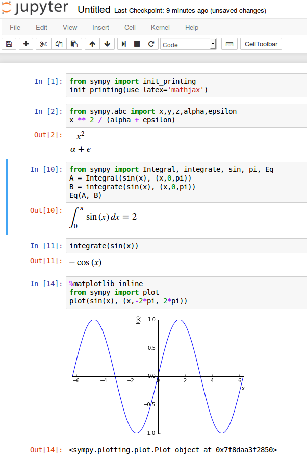

.. ----------------------------------------------------------------------------
.. :Author: Sébastien Labbé, Université de Liège
.. :URL: http://www.slabbe.org/Enseignements/MATH2010/notesdecours.html
.. :Date: Janvier 2017
.. :Licence: CC-SA-BY
.. ----------------------------------------------------------------------------

===============================================================================
                            Logiciels mathématiques
===============================================================================
-----------------------------------------------------------------------------------
Copyright (c) 2016-2017 - Sébastien Labbé <sebastien POINT labbe A labri POINT fr> 
-----------------------------------------------------------------------------------

.. |date| date:: %Y-%m-%d

.. default-role:: math

.. container:: title-logos

   .. image:: images/cc.large.png
      :width: 40px
   .. image:: images/by.large.png
      :width: 40px
   .. image:: images/sa.large.png
      :width: 40px

   |
   | Version du |date|

Ces notes de cours sont rédigées en fonction du nouveau cours de `MATH2010-1
Logiciels mathématiques`__ introduit en 2015-2016 dans le programme de
bachelier en sciences mathématiques de l'Université de Liège. 
Donné en première année du bachelier et totalisant 10 heures d'enseignement
théorique et 20 heures de pratique, il s'agit avant tout de donner un aperçu
des possibilités offertes par les logiciels pour faire des mathématiques.

Le cours se compose de trois parties:

**Partie 1: Utiliser un logiciel de mathématiques -- Jupyter, Python, SymPy (4h, 8h)**
  Calculatrice, arithmétique, algèbre, analyse, calcul symbolique, résolution
  d'équations, trouver les racines d'une fonction, dérivation, intégration,
  équations différentielles, séries, algèbre linéaire, tracer des graphiques.

**Partie 2: Mathématiques avec d'autres logiciels -- Mathematica, GeoGebra, Panda (3h, 6h)**
  Mathématiques avec Mathematica, géométrie, traitement de données, tableurs.

**Partie 3: Introduction à la programmation -- Python (3h, 6h)**
  Variables, expressions, affectation, fonctions, conditions, itérations,
  chaînes de caractères, listes, dictionnaires.

__ http://progcours.ulg.ac.be/cocoon/cours/MATH2010-1.html

**Site du cours:** http://www.slabbe.org/Enseignements/MATH2010/

**Notes de cours (pdf):** http://www.slabbe.org/Enseignements/MATH2010/notesdecours.pdf

**Notes de cours (html):** http://www.slabbe.org/Enseignements/MATH2010/notesdecours.html

**Sources sur Github:** https://github.com/seblabbe/MATH2010-Logiciels-mathematiques

**Remerciements:** Cette page web réutilise les fichiers CSS de l'excellent
livre *From Python to Numpy* de Nicolas Rougier [Rougier]_ paru en janvier
2017. J'ai utilisé les conseils__ de Steve George pour activer la coloration
syntaxique dans les cellules de code Python de cette page.

__ http://www.futurile.net/2015/08/07/writing-highlighting-code-restructured-text/

.. contents:: **Table des matières**
   :class: main-content
   :depth: 1

.. include:: 01-introduction.rst
.. include:: 02-arithmetique-python.rst
.. include:: 03-arithmetique-sympy.rst
.. include:: 04-calcul-symbolique.rst
.. include:: 05-resolution-equation.rst
.. include:: 06-tracer-une-fonction.rst
.. include:: 07-limites-calcul-diff.rst
.. include:: 08-algebre-lineaire.rst
.. include:: 09-mathematica.rst
.. include:: 10-geogebra.rst
.. include:: 11-types-donnees.rst
.. include:: 12-listes.rst
.. include:: 13-boucle-for.rst
.. include:: 14-conditions.rst
.. include:: 15-fonctions.rst
.. include:: 16-boucle-while.rst
.. include:: 17-exemples.rst
.. include:: 18-autres-structures-donnees.rst
.. include:: 19-panda.rst
.. include:: bibliographie.rst

.. .. include:: tout-le-reste.rst

.. todo: Chapitre IPython Jupyter avec In[4], touche TAB, etc.

.. http://restructuredtext.readthedocs.org/en/latest/sphinx_tutorial.html

